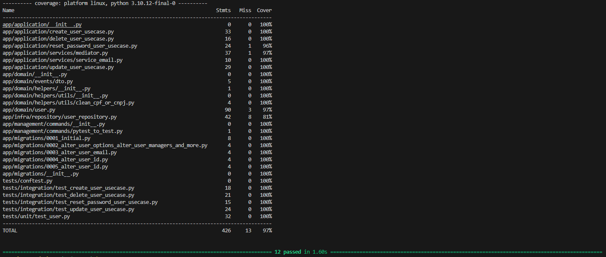

# Sistema de Gerenciamento de Usuários

Este é um projeto de Sistema de Gerenciamento de Usuários desenvolvido em Django, utilizando o Django REST Framework para construir uma API RESTful. O projeto inclui funcionalidades como autenticação de usuários, gerenciamento de perfis, testes unitários e de integração, documentação da API utilizando Swagger, e integração com uma API externa para enriquecimento de dados.

## Tecnologias Utilizadas

- **Django:** Framework web em Python utilizado para desenvolver a aplicação.
- **Django REST Framework (DRF):** Biblioteca que facilita a criação de APIs RESTful em Django.
- **Simple JWT:** Biblioteca para autenticação JWT (JSON Web Token) utilizada para proteger as rotas sensíveis da API.
- **MySQL:** Banco de dados relacional utilizado para armazenar os dados dos usuários e perfis.
- **Poetry:** Gerenciador de dependências utilizado para garantir um ambiente de desenvolvimento consistente.
- **Testes Unitários e de Integração:** Implementados para garantir a qualidade do código e funcionalidade da API.
- **Swagger:** Ferramenta utilizada para documentar automaticamente a API, facilitando o entendimento e uso por parte de outros desenvolvedores.
- **Design Patterns:** Padrões de projeto utilizados para estruturar o código de forma mais eficiente e modular.
- **Tratamento de Erros:** Implementado de forma adequada em toda a API para lidar com exceções de forma eficiente.
- **Programação Orientada a Objetos:** Utilizada para estruturar o código de forma mais organizada e reutilizável.
- **Tipagem de Dados:** Utilizada para tornar o código mais legível e seguro, utilizando as funcionalidades de tipagem estática do Python.
- **Sentry:** Plataforma de monitoramento de desempenho e de erros que ajuda os desenvolvedores a detectar, diagnosticar e corrigir problemas em seus aplicativos. A API está integrada com o Sentry para realizar o log e monitoramento de erros.
- **Docker Compose:** Utilizado para automatizar a instalação e execução do projeto em um ambiente Dockerizado.


## Funcionalidades

- **Autenticação de Usuários:** Utilizando o Simple JWT para gerar tokens JWT que são enviados para autenticar os usuários em rotas sensíveis da API.
- **Gerenciamento de Perfis:** Permitindo a criação, leitura, atualização e exclusão de perfis de usuários.
- **Reset de senha:** Permite resetar a senha do usuário com o recebimento de email.
- **Testes:** Implementação de testes unitários e de integração para garantir a qualidade e funcionalidade da API.
- **Integração com API Externa:** Implementação de integração com uma API externa para enriquecer os dados dos usuários.
- **Log e monitoração:** Implementei o sentry para monitoramentro e log da aplicação.
## Como Executar o Projeto

1. Clone este repositório:
   ```
   git clone https://github.com/felipeit/teste_makes
   ```

2. Navegue até o diretório do projeto:
   ```
   cd teste_makes
   ```

3. Execute o Docker Compose para construir e iniciar os serviços:
   ```
   docker compose up --build
   ```

4. Executar os tests
   ```
   docker exec api pytest -vv --cov
   ```
   
   
5. Acesse a documentação da API em: [http://localhost:8000/](http://localhost:8000/)

## Autor

- Felipe Silva
- felipe.it99@gmail.com

---